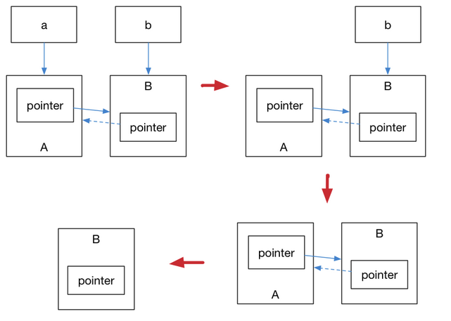

# 1. 迈向现代C++

## 1.1 被启用的特性

**注意**：弃用并非彻底不能用，只是用于暗示程序员这些特性将从未来的标准中消失，应该尽量避免使用。但是，已弃用的特性依然是标准库的一部分，并且出于兼容性的考虑，大部分特性其实会『永久』保留。

* 不允许字符串常量赋值给`char *`。如果需要用字符串常量赋值和初始化一个`char *`，应该使用`const char *` 或者`auto`

```cpp
char *str = "hello world"; //将出现弃用警告
```

* C++98异常说明，**`unexpected_handler`、`set_unexpected()` 等相关特性被弃用，应该使用 `noexcept`。**
* auto_ptr被弃用，应该使用`unique_ptr`


## 1.2 与C的兼容性

出于一些不可抗力、历史原因，我们不得不在 C++ 中使用一些 C 语言代码（甚至古老的 C 语言代码），例如 Linux 系统调用。在现代 C++ 出现之前，大部分人当谈及『C 与 C++ 的区别是什么』时，普遍除了回答面向对象的类特性、泛型编程的模板特性外，就没有其他的看法了，甚至直接回答『差不多』，也是大有人在。图 1.2 中的韦恩图大致上回答了 C 和 C++ 相关的兼容情况。
在这里插入图片描述

**C++不是C的一个超集，这个观念从一开始就是错的！**
在编写C++代码的时候，应该尽量避免使用**void***之类的程序风格，在不得已使用C的时候，应该用`extern "C"`这种特性，将C++代码和C语言的代码分离编译，再统一链接。

```cpp
// foo.h
#ifdef __cplusplus
extern "C" {
#endif

int add(int x, int y);

#ifdef __cplusplus
}
#endif

// foo.c
int add(int x, int y) {
    return x+y;
}

// 1.1.cpp
#include "foo.h"
#include <iostream>
#include <functional>

int main() {
    [out = std::ref(std::cout << "Result from C code: " << add(1, 2))](){
        out.get() << ".\n";
    }();
    return 0;
}
```

应该先使用`gcc`编译C语言的代码
`gcc -c foo.c`
编译出foo.o的文件，再用`g++/clang++`将C++代码和.o文件进行链接(或者都编译成为.o文件再统一进行链接):
`clang++ 1.1.cpp foo.o -std=c++2a -o 1.1`

# 2. 语言可用性的强化

当我们声明、定义一个变量或者常量，对代码进行流程控制、面向对象的功能、模板编程等这些都是运行时之前，可能发生在编写代码或编译器编译代码时的行为。为此，我们通常谈及语言可用性，是指那些发生在运行时之前的语言行为。

## 2.1 常量

### nullptr

`nullptr`是为了替代`NULL`。传统C++会把`NULL`、`0`视为同一种东西，这要取决于编译器如何定义`NULL`，有些编译器是直接定义成`0`或者`((void*)0)`。
C++不允许直接将`void *`隐式转换成其他类型，但是如果编译器尝试把`(void*0)`,那么在下面这句代码中：

```cpp
char *ch = NULL;
```

没有了` void *` 隐式转换的 C++ 只好将 `NULL` 定义为 0。而这依然会产生新的问题，将 NULL 定义成 0 将导致 C++ 中重载特性发生混乱。考虑下面这两个 foo 函数：

```cpp
void foo(char*);
void foo(int);
```

那么`foo(NULL)`将会调用`void foo(int)`，反人类。
因此，C++11引入了`nullptr`专门用来区分空指针和0。`nullptr`类型为`nullptr_t`,能够隐式转换成任何指针或成员指针的类型，也可以和他们之间比较相等或不等。

```cpp
#include <iostream>
#include <type_traits>

void foo(char *);
void foo(int);

int main() {
    if (std::is_same<decltype(NULL), decltype(0)>::value)
        std::cout << "NULL == 0" << std::endl;
    if (std::is_same<decltype(NULL), decltype((void*)0)>::value)
        std::cout << "NULL == (void *)0" << std::endl;
    if (std::is_same<decltype(NULL), std::nullptr_t>::value)
        std::cout << "NULL == nullptr" << std::endl;

    foo(0);          // 调用 foo(int)
    foo(nullptr);    // 调用 foo(char*)
    return 0;
}

void foo(char *) {
    std::cout << "foo(char*) is called" << std::endl;
}
void foo(int i) {
    std::cout << "foo(int) is called" << std::endl;
}
```

输出：
`foo(int) is called `
`foo(char*) is called`

### constexpr

C++本身已经具备了常量表达式的概念，如`1+2`,`3x4`这种表达式会产生相同的结果并且没有副作用。如果编译器能够在编译的时候能将这些表达式直接优化并植入程序运行时，能够增加程序的性能。如:

```cpp
#include <iostream>
#define LEN 10

int len_foo() {
    int i = 2;
    return i;
}
constexpr int len_foo_constexpr() {
    return 5;
}

constexpr int fibonacci(const int n) {
    return n == 1 || n == 2 ? 1 : fibonacci(n-1)+fibonacci(n-2);
}

int main() {
    char arr_1[10];                      // 合法
    char arr_2[LEN];                     // 合法

    int len = 10;
    // char arr_3[len];                  // 非法

    const int len_2 = len + 1;
    constexpr int len_2_constexpr = 1 + 2 + 3;
    // char arr_4[len_2];                // 非法
    char arr_4[len_2_constexpr];         // 合法

    // char arr_5[len_foo()+5];          // 非法
    char arr_6[len_foo_constexpr() + 1]; // 合法

    std::cout << fibonacci(10) << std::endl;
    // 1, 1, 2, 3, 5, 8, 13, 21, 34, 55
    std::cout << fibonacci(10) << std::endl;
    return 0;
}
```

在上面的例子中，`char arr_4[len_2]`比较迷惑，因为`len_2`已经被定义成了一个常量。
为什么仍然是非法的?这是因为C++标准中数组的长度必须是一个常量表达式，而这个变量是`const`常数，而不是一个常量表达式。因此(现在很多编译器支持这种行为)这是非法行为，我们需要使用C++引入`constexor`特性来解决这个问题；对于`arr_5`来说，C++98之前的编译器无法得知函数在运行期间返回的实际是一个常数，因此也导致了非法行为的产生。
C++11 提供了 `constexpr `让用户显式的声明函数或对象构造函数在编译期会成为常量表达式，这个关键字明确的告诉编译器应该去验证 `len_foo` 在编译期就应该是一个常量表达式。
此外，`constexpr` 修饰的函数可以使用递归：

```cpp
constexpr int fibonacci(const int n) {
    return n == 1 || n == 2 ? 1 : fibonacci(n-1)+fibonacci(n-2);
}
```

从 C++14 开始，`constexpr`函数可以在内部使用局部变量、循环和分支等简单语句，例如下面的代码在 C++11 的标准下是不能够通过编译的：

```cpp
constexpr int fibonacci(const int n) {
    if(n == 1) return 1;
    if(n == 2) return 1;
    return fibonacci(n-1) + fibonacci(n-2);
}
```

### const和constexpr的作用和区别

**对于变量来说**

* const表示这个变量无法修改，但是并没有限定这个变量时编译期间的常量还是运行期间的常量
* constexpr表示这个变量只能是编译期间的常量

```cpp
const int kSize = 1; // 编译期常量

void func()
{
    const int kRandomNumber = get_a_random_number(); // 运行期常量
    ...
    ...
}
```

对于 kSize，你既可以用 const 修饰，也可以用 constexpr。但对于 kRandomNumber，你只能用 const。
**对于函数来说**

* const修饰的一般都是成员函数，用来表示这个函数不会对成员变量产生写的操作
* constexpr实际是`const expression`，即常量表达式

```cpp
constexpr int func(int i)
{
    return i + 1;
}

int main()
{
    int i             = 10;
    const int ci      = 10;
    constexpr int cei = 10;

    std::array<int, func(i)>   arr1; // 编译错误
    std::array<int, func(ci)>  arr2; // 没问题
    std::array<int, func(cei)> arr3; // 没问题
    std::array<int, func(10)>  arr4; // 没问题

    func(i); // 直接使用，也是没问题的

    return 0;
}
```

**constexpr**修饰的函数，简单来说，如果传入的参数可以再编译期间算出来，那么这个函数就产生编译时期的值。但是如果传入的参数不能在编译期间算出，那么该关键字修饰的函数，就和普通函数一样，比如上面代码，直接调用了`fun(i)`。不过我们不必因此写两个版本。

## 2.2 变量及其初始化

### if/switch变量声明强化

在传统 C++ 中，变量的声明虽然能够位于任何位置，甚至于` for` 语句内能够声明一个临时变量 `int`，但始终没有办法在 `if` 和 `switch` 语句中声明一个临时的变量。例如：

```cpp
#include <iostream>
#include <vector>
#include <algorithm>

int main() {
    std::vector<int> vec = {1, 2, 3, 4};

    // 在 c++17 之前
    const std::vector<int>::iterator itr = std::find(vec.begin(), vec.end(), 2);
    if (itr != vec.end()) {
        *itr = 3;
    }

    // 需要重新定义一个新的变量
    const std::vector<int>::iterator itr2 = std::find(vec.begin(), vec.end(), 3);
    if (itr2 != vec.end()) {
        *itr2 = 4;
    }

    // 将输出 1, 4, 3, 4
    for (std::vector<int>::iterator element = vec.begin(); element != vec.end(); 
        ++element)
        std::cout << *element << std::endl;
}
```

在上面的代码中，我们可以看到 `itr` 这一变量是定义在整个 `main()` 的作用域内的，这导致当我们需要再次遍历整个 `std::vector` 时，需要重新命名另一个变量。C++17 消除了这一限制，使得我们可以在` if`（或 `switch`）中完成这一操作：

```cpp
// 将临时变量放到 if 语句内
if (const std::vector<int>::iterator itr = std::find(vec.begin(), vec.end(), 3);
    itr != vec.end()) {
    *itr = 4;
}
```

### 初始化列表

初始化是一个非常重要的语言特性，最常见的就是在对象进行初始化时进行使用。 在传统 C++ 中，不同的对象有着不同的初始化方法，例如普通数组、 POD （Plain Old Data，即没有构造、析构和虚函数的类或结构体） 类型都可以使用` {}` 进行初始化，也就是我们所说的初始化列表。 而对于类对象的初始化，要么需要通过拷贝构造、要么就需要使用 `()` 进行。 这些不同方法都针对各自对象，不能通用。例如：

```cpp
#include <iostream>
#include <vector>

class Foo {
public:
    int value_a;
    int value_b;
    Foo(int a, int b) : value_a(a), value_b(b) {}
};

int main() {
    // before C++11
    int arr[3] = {1, 2, 3};
    Foo foo(1, 2);
    std::vector<int> vec = {1, 2, 3, 4, 5};

    std::cout << "arr[0]: " << arr[0] << std::endl;
    std::cout << "foo:" << foo.value_a << ", " << foo.value_b << std::endl;
    for (std::vector<int>::iterator it = vec.begin(); it != vec.end(); ++it) {
        std::cout << *it << std::endl;
    }
    return 0;
}
```

为解决这个问题，C++11 首先把初始化列表的概念绑定到类型上，称其为 `std::initializer_list`，允许构造函数或其他函数像参数一样使用初始化列表，这就为类对象的初始化与普通数组和 POD 的初始化方法提供了统一的桥梁，例如：

```cpp
#include <initializer_list>
#include <vector>
#include <iostream>

class MagicFoo {
public:
    std::vector<int> vec;
    MagicFoo(std::initializer_list<int> list) {
        for (std::initializer_list<int>::iterator it = list.begin();
             it != list.end(); ++it)
            vec.push_back(*it);
    }
};
int main() {
    // after C++11
    MagicFoo magicFoo = {1, 2, 3, 4, 5};

    std::cout << "magicFoo: ";
    for (std::vector<int>::iterator it = magicFoo.vec.begin(); 
        it != magicFoo.vec.end(); ++it) 
        std::cout << *it << std::endl;
}
```

这种构造函数被叫做初始化列表构造函数，具有这种构造函数的类型将在初始化时被特殊关照。
初始化列表除了用在对象构造上，还能将其作为普通函数的形参，例如：

```cpp
public:
    void foo(std::initializer_list<int> list) {
        for (std::initializer_list<int>::iterator it = list.begin();
            it != list.end(); ++it) vec.push_back(*it);
    }

magicFoo.foo({6,7,8,9});
```

其次，C++11 还提供了统一的语法来初始化任意的对象，例如：

```cpp
Foo foo2 {3, 4};
```

### 结构化绑定

结构化绑定提供了类似其他语言中提供的多返回值的功能。在容器一章中，我们会学到 C++11 新增了 `std::tuple` 容器用于构造一个元组，进而囊括多个返回值。但缺陷是，C++11/14 并没有提供一种简单的方法直接从元组中拿到并定义元组中的元素，尽管我们可以使用 `std::tie` 对元组进行拆包，但我们依然必须非常清楚这个元组包含多少个对象，各个对象是什么类型，非常麻烦。

C++17 完善了这一设定，给出的结构化绑定可以让我们写出这样的代码：

```cpp
#include <iostream>
#include <tuple>

std::tuple<int, double, std::string> f() {
    return std::make_tuple(1, 2.3, "456");
}

int main() {
    auto [x, y, z] = f();
    std::cout << x << ", " << y << ", " << z << std::endl;
    return 0;
}
```

#### std::tuple 和 std::tie的基本用法

* 定义和初始化

```cpp
tuple<int,double,string> t3 = {1, 2.0, "3"};
```

* 访问
  可以使用`get<常量表达式>(tuple_name)`来访问或修改tuple的元素（返回引用）

```cpp
    get<0>(t3) = 4;
    cout << get<1>(t3) << endl;

```

* 批量赋值
  std::tie会将变量的引用整合成一个tuple，从而实现批量赋值。

```cpp
    int i; double d; string s;
    tie(i, d, s) = t3;

    cout << i << " " << d << " " << s << endl;
```

* 还可以使用std::ignore忽略某些tuple中的某些返回值，如

```cpp
tie(i, ignore, s) = t3;
```

* 需要注意的是，tie无法直接从初始化列表获得值，比如下面第5行会编译错误。

```cpp
    int i; double d; string s;
    tuple<int,double,string> t3 = {1, 2.0, "3"};
    tie(i, d, s) = t3;
    t3 = {1, 2.0, "3"};
    tie(i, d, s) = {1, 2.0, "3"};
```

## 2.3 类型推导

在传统 C 和 C++ 中，参数的类型都必须明确定义，这其实对我们快速进行编码没有任何帮助，尤其是当我们面对一大堆复杂的模板类型时，必须明确的指出变量的类型才能进行后续的编码，这不仅拖慢我们的开发效率，也让代码变得又臭又长。

C++11 引入了 `auto` 和 `decltype` 这两个关键字实现了类型推导，让编译器来操心变量的类型。这使得 C++ 也具有了和其他现代编程语言一样，某种意义上提供了无需操心变量类型的使用习惯。

### auto

使用`auto` 进行类型推导的一个最为常见而且显著的例子就是迭代器。你应该在前面的小节里看到了传统 C++ 中冗长的迭代写法：

```cpp
// 在 C++11 之前
// 由于 cbegin() 将返回 vector<int>::const_iterator
// 所以 it 也应该是 vector<int>::const_iterator 类型
for(vector<int>::const_iterator it = vec.cbegin(); it != vec.cend(); ++it)


//After C++··
#include <initializer_list>
#include <vector>
#include <iostream>

class MagicFoo {
public:
    std::vector<int> vec;
    MagicFoo(std::initializer_list<int> list) {
        // 从 C++11 起, 使用 auto 关键字进行类型推导
        for (auto it = list.begin(); it != list.end(); ++it) {
            vec.push_back(*it);
        }
    }
};
int main() {
    MagicFoo magicFoo = {1, 2, 3, 4, 5};
    std::cout << "magicFoo: ";
    for (auto it = magicFoo.vec.begin(); it != magicFoo.vec.end(); ++it) {
        std::cout << *it << ", ";
    }
    std::cout << std::endl;
    return 0;
}
```

一些其他的常见用法：

```cpp
auto i = 5;              // i 被推导为 int
auto arr = new auto(10); // arr 被推导为 int *
```

从 C++ 20 起，`auto` 甚至能用于函数传参，考虑下面的例子：

```cpp
int add(auto x, auto y) {
    return x+y;
}
auto i = 5; // 被推导为 int
auto j = 6; // 被推导为 int
std::cout << add(i, j) << std::endl;
```

**注意：auto 还不能用于推导数组类型：**

```cpp
auto auto_arr2[10] = {arr}; // 错误, 无法推导数组元素类型

2.6.auto.cpp:30:19: error: 'auto_arr2' declared as array of 'auto'
    auto auto_arr2[10] = {arr};
```

### decltype

`decltype `关键字是为了解决` auto` 关键字只能对变量进行类型推导的缺陷而出现的。它的用法和 `typeof `很相似：`decltype(表达式)`
有时候，我们可能需要计算某个表达式的类型，例如：

```cpp
auto x = 1;
auto y = 2;
decltype(x+y) z;
```

你已经在前面的例子中看到 `decltype` 用于推断类型的用法，下面这个例子就是判断上面的变量` x, y, z `是否是同一类型：

```cpp
if (std::is_same<decltype(x), int>::value)
    std::cout << "type x == int" << std::endl;
if (std::is_same<decltype(x), float>::value)
    std::cout << "type x == float" << std::endl;
if (std::is_same<decltype(x), decltype(z)>::value)
    std::cout << "type z == type x" << std::endl;
```

其中，`std::is_same<T, U>` 用于判断 `T` 和 `U` 这两个类型是否相等。输出结果为：

```cpp
type x == int
type z == type x
```

### 尾返回类型推导

你可能会思考，在介绍 `auto` 时，我们已经提过` auto` 不能用于函数形参进行类型推导，那么 `auto` 能不能用于推导函数的返回类型呢？还是考虑一个加法函数的例子，在传统 C++ 中我们必须这么写：

```cpp
template<typename R, typename T, typename U>
R add(T x, U y) {
    return x+y;
}
```

**注意：typename 和 class 在模板参数列表中没有区别，在 typename 这个关键字出现之前，都是使用 class 来定义模板参数的。但在模板中定义有嵌套依赖类型的变量时，需要用 typename 消除歧义**   

这样的代码其实变得很丑陋，因为程序员在使用这个模板函数的时候，必须明确指出返回类型。但事实上我们并不知道 `add()` 这个函数会做什么样的操作，以及获得一个什么样的返回类型。

在 C++11 中这个问题得到解决。虽然你可能马上会反应出来使用 `decltype` 推导 x+y 的类型，写出这样的代码：

```cpp
decltype(x+y) add(T x, U y)
```

但事实上这样的写法并不能通过编译。这是因为在编译器读到 `decltype(x+y)` 时，x 和 y 尚未被定义。为了解决这个问题，C++11 还引入了一个叫做尾返回类型（trailing return type），利用 `auto` 关键字将返回类型后置：

```cpp
template<typename T, typename U>
auto add2(T x, U y) -> decltype(x+y){
    return x + y;
}
```

令人欣慰的是从 C++14 开始是可以直接让普通函数具备返回值推导，因此下面的写法变得合法：

```cpp
template<typename T, typename U>
auto add3(T x, U y){
    return x + y;
}
```

可以检查一下类型推导是否正确：

```cpp
// after c++11
auto w = add2<int, double>(1, 2.0);
if (std::is_same<decltype(w), double>::value) {
    std::cout << "w is double: ";
}
std::cout << w << std::endl;

// after c++14
auto q = add3<double, int>(1.0, 2);
std::cout << "q: " << q << std::endl;
```

### decltype(auto)

`decltype(auto) `是 C++14 开始提供的一个略微复杂的用法。
简单来说，`decltype(auto)` 主要用于对转发函数或封装的返回类型进行推导，它使我们无需显式的指定 `decltype` 的参数表达式。考虑看下面的例子，当我们需要对下面两个函数进行封装时：

```cpp
std::string  lookup1();
std::string& lookup2();
```

在 C++11 中，封装实现是如下形式：

```cpp
std::string look_up_a_string_1() {
    return lookup1();
}
std::string& look_up_a_string_2() {
    return lookup2();
}
```

而有了 decltype(auto)，我们可以让编译器完成这一件烦人的参数转发：

```cpp
decltype(auto) look_up_a_string_1() {
    return lookup1();
}
decltype(auto) look_up_a_string_2() {
    return lookup2();
}
```

## 2.4 控制流

### if constexpr

正如本章开头出，我们知道了 C++11 引入了 `constexpr `关键字，它将表达式或函数编译为常量结果。一个很自然的想法是，如果我们把这一特性引入到条件判断中去，让代码在编译时就完成分支判断，岂不是能让程序效率更高？C++17 将 `constexpr` 这个关键字引入到 `if `语句中，允许在代码中声明常量表达式的判断条件，考虑下面的代码：

```cpp
#include <iostream>

template<typename T>
auto print_type_info(const T& t) {
    if constexpr (std::is_integral<T>::value) {
        return t + 1;
    } else {
        return t + 0.001;
    }
}
int main() {
    std::cout << print_type_info(5) << std::endl;
    std::cout << print_type_info(3.14) << std::endl;
}
```

在编译时，实际代码就会表现为如下：

```cpp
int print_type_info(const int& t) {
    return t + 1;
}
double print_type_info(const double& t) {
    return t + 0.001;
}
int main() {
    std::cout << print_type_info(5) << std::endl;
    std::cout << print_type_info(3.14) << std::endl;
}
```

### 区间for迭代

```cpp
#include <iostream>
#include <vector>
#include <algorithm>

int main() {
    std::vector<int> vec = {1, 2, 3, 4};
    if (auto itr = std::find(vec.begin(), vec.end(), 3); itr != vec.end()) *itr = 4;
    for (auto element : vec)
        std::cout << element << std::endl; // read only
    for (auto &element : vec) {
        element += 1;                      // writeable
    }
    for (auto element : vec)
        std::cout << element << std::endl; // read only
}
```

## 2.5 模板

C++ 的模板一直是这门语言的一种特殊的艺术，模板甚至可以独立作为一门新的语言来进行使用。模板的哲学在于将一切能够在编译期处理的问题丢到编译期进行处理，仅在运行时处理那些最核心的动态服务，进而大幅优化运行期的性能。因此模板也被很多人视作 C++ 的黑魔法之一。

### 外部模板

传统C++中，模板只有在使用的时候才会被编译器实例化。换句话说，只要在每个编译单元（文件）中编译的代码终于到了被完整定义的模板，都会被实例化。这就产生了重复实例化而导致的变异时间增加。并且，我们没有办法通知编译器不要触发模板的实例化:

```cpp
template class std::vector<bool>;          // 强行实例化
extern template class std::vector<double>; // 不在该当前编译文件中实例化模板
```

[外部模板具体讲解](https://blog.csdn.net/jinzhu1911/article/details/120104198)

### 尖括号">"

在传统C++的编译器中，`>>`会被当成右移运算符进行处理。但实际我们很容易就写出了嵌套模板的代码:

```cpp
std::vector<std::vector<int>> matrix;
```

这在传统 C++ 编译器下是不能够被编译的，而 C++11 开始，连续的右尖括号将变得合法，并且能够顺利通过编译。甚至于像下面这种写法都能够通过编译：

```cpp
template<bool T>
class MagicType {
    bool magic = T;
};

// in main function:
std::vector<MagicType<(1>2)>> magic; // 合法, 但不建议写出这样的代码
```

### 类型别名模板

在了解类型别名模板之前，需要理解`模板`和`类型`的不同。**模板是用来产生类型的。**在传统C++中，`typedef`可以为类型定义一个新的名称，但是没有办法为模板定义一个新的名称。因为，模板不是类型。

```cpp
template<typename T, typename U>
class MagicType {
public:
    T dark;
    U magic;
};

// 不合法
template<typename T>
typedef MagicType<std::vector<T>, std::string> FakeDarkMagic;
```

C++11引入了`using`这种写法，并且指出传统的`typedef`的功能。

通常我们使用 typedef 定义别名的语法是：typedef 原名称 新名称;，但是对函数指针等别名的定义语法却不相同，这通常给直接阅读造成了一定程度的困难。

```cpp
typedef int (*process)(void *);
using NewProcess = int(*)(void *);
template<typename T>
using TrueDarkMagic = MagicType<std::vector<T>, std::string>;

int main() {
    TrueDarkMagic<bool> you;
}
```

#### 补充

函数指针在typedef和using下的类型声明

```cpp
int func(char chr, double val) {
	// do something
}
//typedef
typedef int (*FunctionType1)(char, double);
FunctionType1 func_ptr = &func; // &可以不加

//using
using FunctionType2 = int (*) (char, double);
FunctionType2 func_ptr = &func;	// func同上

```

* 例子

```cpp
#include <iostream>

int max(int a, int b) {
    return a < b ? b : a;
}
// 利用typedef，声明一个函数指针[类型]
typedef int (*comp_type)(int, int);  
// 定义一个函数指针[对象]，其指向nullptr
int (*comp_ptr) (int, int) = nullptr;    
// c++11的类型别名，与typedef类似，同样声明了一个函数指针[类型]
using comp_using = int (*)(int, int);    

int main (int argc, char** argv) {

    std::cout << "typedef" << std::endl;
    comp_type c_ptr = &max;
    std::cout << c_ptr(3, 4) << std::endl;

    std::cout << "pointer" << std::endl;
    comp_ptr = &max;
    std::cout << comp_ptr(3, 4) << std::endl;

    std::cout << "using" << std::endl;
    comp_using using_ptr = &max;
    std::cout << using_ptr(3, 4) << std::endl;

    return 0;
}

```


### 变长参数模板

模板一直是 C++ 所独有的黑魔法之一。 在 C++11 之前，无论是类模板还是函数模板，都只能按其指定的样子， 接受一组固定数量的模板参数；而 C++11 加入了新的表示方法， 允许任意个数、任意类别的模板参数，同时也不需要在定义时将参数的个数固定。

```cpp
template<typename... Ts> class Magic;
```

模板类Magic的对象，能够接受不限制个数的typename作为模板的形式参数，如

```cpp
class Magic<int,
            std::vector<int>,
            std::map<std::string,
            std::vector<int>>> darkMagic;
```

既然是任意形式，所以个数为 `0 `的模板参数也是可以的：`class Magic<> nothing`;。

如果不希望产生的模板参数个数为` 0`，可以手动的定义至少一个模板参数：

```cpp
template<typename Require, typename... Args> class Magic;
```

变长参数模板也能够调整到模板函数上。传统C中的`printf`函数，虽然也能达成不定个数的形参的调用，但是并非类别安全。而茶untongdeC++11除了能定义类别安全的变长参数函数外，还可以使类似 `printf `的函数能自然地处理非自带类别的对象。 除了在模板参数中能使用 `...` 表示不定长模板参数外， 函数参数也使用同样的表示法代表不定长参数， 这也就为我们简单编写变长参数函数提供了便捷的手段，例如：

```cpp
template<typename... Args> void printf(const std::string &str, Args... args);
```

* 类别安全

```cpp
void printf(const char* s) {
  while (*s) {
    if (*s == '%' && *++s != '%') 
      throw std::runtime_error("invalid format string: missing arguments");
    std::cout << *s++;
  }
}

template<typename T, typename... Args>
void printf(const char* s, const T& value, const Args&... args) {
  while (*s) {
    if (*s == '%' && *++s != '%') {
      std::cout << value;
      return printf(++s, args...);
    }
    std::cout << *s++;
  }
  throw std::runtime_error("extra arguments provided to printf");
}
```

对于传递给可变模板版本的所有参数，它们的类型在编译时是已知的。这些知识保存在函数中。然后，每个对象都被传递给cout，并带有严重过载的运算符<<。对于传递的每个类型，都有一个单独的此函数重载。换句话说，如果你传递一个int，它调用的是ostream:：operator<<（int）；如果你传递了一个double，它调用了ostream::：operator<（double）。因此，该类型再次被保留。这些函数中的每一个都专门用于以适当的方式处理每一种类型。这就是类型安全。


那么我们定义了变长的模板参数，如何对参数进行解包呢？

首先，我们可以使用 `sizeof...` 来计算参数的个数，：

```cpp
template<typename... Ts>
void magic(Ts... args) {
    std::cout << sizeof...(args) << std::endl;
}
```

我们可以传递任意个参数给 `magic `函数：

```cpp
magic(); // 输出0
magic(1); // 输出1
magic(1, ""); // 输出2
```

其次，对参数进行解包，到目前为止还没有一种简单的方法能够处理参数包，但有两种经典的处理手法：
**1. 递归模板函数**
递归是非常容易想到的一种手段，也是最经典的处理方法。这种方法不断递归地向函数传递模板参数，进而达到递归遍历所有模板参数的目的：

```cpp
#include <iostream>
template<typename T0>
void printf1(T0 value) {
    std::cout << value << std::endl;
}
template<typename T, typename... Ts>
void printf1(T value, Ts... args) {
    std::cout << value << std::endl;
    printf1(args...);
}
int main() {
    printf1(1, 2, "123", 1.1);
    return 0;
}
```

**2. 变参模板展开**
你应该感受到了这很繁琐，在 C++17 中增加了变参模板展开的支持，于是你可以在一个函数中完成` printf` 的编写：

```cpp
template<typename T0, typename... T>
void printf2(T0 t0, T... t) {
    std::cout << t0 << std::endl;
    if constexpr (sizeof...(t) > 0) printf2(t...);
}
```

**3. 初始化列表展开**
递归模板函数是一种标准的做法，但缺点显而易见的在于必须定义一个终止递归的函数。

这里介绍一种使用初始化列表展开的黑魔法：

```cpp
template<typename T, typename... Ts>
auto printf3(T value, Ts... args) {
	    std::cout << value << std::endl;
	    (void) std::initializer_list<T>{([&args] {
	        std::cout << args << std::endl;
	    }(), value)...};
}
```

在这个代码中，额外使用了 C++11 中提供的初始化列表以及 Lambda 表达式的特性）。
通过初始化列表，`(lambda 表达式, value)... `将会被展开。由于逗号表达式的出现，首先会执行前面的 lambda 表达式，完成参数的输出。 为了避免编译器警告，我们可以将` std::initializer_list` 显式的转为` void`。

### 折叠表达式

C++ 17 中将变长参数这种特性进一步带给了表达式，考虑下面这个例子：

```cpp
#include <iostream>
template<typename ... T>
auto sum(T ... t) {
    return (t + ...);
}
int main() {
    std::cout << sum(1, 2, 3, 4, 5, 6, 7, 8, 9, 10) << std::endl;
}
```

### 非类型模板参数推导

前面我们主要提及的是模板参数的一种形式：类型模板参数。

```cpp
template <typename T, typename U>
auto add(T t, U u) {
    return t+u;
}
```

其中模板的参数 `T `和 `U `为具体的类型。 但还有一种常见模板参数形式可以让不同字面量成为模板参数，即非类型模板参数：

```cpp
template <typename T, int BufSize>
class buffer_t {
public:
    T& alloc();
    void free(T& item);
private:
    T data[BufSize];
}

buffer_t<int, 100> buf; // 100 作为模板参数
```

在这种模板参数形式下，我们可以将` 100` 作为模板的参数进行传递。 在 C++11 引入了类型推导这一特性后，我们会很自然的问，既然此处的模板参数 以具体的字面量进行传递，能否让编译器辅助我们进行类型推导， 通过使用占位符 `auto `从而不再需要明确指明类型？ 幸运的是，C++17 引入了这一特性，我们的确可以` auto` 关键字，让编译器辅助完成具体类型的推导， 例如：

```cpp
template <auto value> void foo() {
    std::cout << value << std::endl;
    return;
}

int main() {
    foo<10>();  // value 被推导为 int 类型
}
```

## 2.6 面向对象

### 委托构造

C++11 引入了委托构造的概念，这使得构造函数可以在同一个类中一个构造函数调用另一个构造函数，从而达到简化代码的目的：

```cpp
#include <iostream>
class Base {
public:
    int value1;
    int value2;
    Base() {
        value1 = 1;
    }
    Base(int value) : Base() { // 委托 Base() 构造函数
        value2 = value;
    }
};

int main() {
    Base b(2);
    std::cout << b.value1 << std::endl;
    std::cout << b.value2 << std::endl;
}
```

### 继承构造

在传统C++中，构造函数如果需要继承是要将参数一一传递的，会导致效率低下。
C++11引入了关键字`using`引入了继承构造的概念

```cpp
#include <iostream>
class Base {
public:
    int value1;
    int value2;
    Base() {
        value1 = 1;
    }
    Base(int value) : Base() { // 委托 Base() 构造函数
        value2 = value;
    }
};
class Subclass : public Base {
public:
    using Base::Base; // 继承构造
};
int main() {
    Subclass s(3);
    std::cout << s.value1 << std::endl;
    std::cout << s.value2 << std::endl;
}
```

### 显式虚函数重载

在传统 C++ 中，经常容易发生意外重载虚函数的事情。例如：

```cpp
struct Base {
    virtual void foo();
};
struct SubClass: Base {
    void foo();
};
```

`SubClass::foo `可能并不是程序员尝试重载虚函数，只是恰好加入了一个具有相同名字的函数。另一个可能的情形是，当基类的虚函数被删除后，子类拥有旧的函数就不再重载该虚拟函数并摇身一变成为了一个普通的类方法，这将造成灾难性的后果。

C++11 引入了 `override `和 `final` 这两个关键字来防止上述情形的发生。

* override
  当重载虚函数时，引入 `override `关键字将显式的告知编译器进行重载，编译器将检查基函数是否存在这样的虚函数，否则将无法通过编译：

```cpp

struct Base {
    virtual void foo(int);
};
struct SubClass: Base {
    virtual void foo(int) override; // 合法
    virtual void foo(float) override; // 非法, 父类没有此虚函数
};
```

* final
  `final` 则是为了防止类被继续继承以及终止虚函数继续重载引入的。

```cpp
struct Base {
    virtual void foo() final;
};
struct SubClass1 final: Base {
}; // 合法

struct SubClass2 : SubClass1 {
}; // 非法, SubClass1 已 final

struct SubClass3: Base {
    void foo(); // 非法, foo 已 final
};
```

### 显式禁用默认函数

在传统 C++ 中，如果程序员没有提供，编译器会默认为对象生成默认构造函数、 复制构造、赋值算符以及析构函数。 另外，C++ 也为所有类定义了诸如` new delete` 这样的运算符。 当程序员有需要时，可以重载这部分函数。

这就引发了一些需求：无法精确控制默认函数的生成行为。 例如禁止类的拷贝时，必须将复制构造函数与赋值算符声明为` private`。 尝试使用这些未定义的函数将导致编译或链接错误，则是一种非常不优雅的方式。

并且，编译器产生的默认构造函数与用户定义的构造函数无法同时存在。 若用户定义了任何构造函数，编译器将不再生成默认构造函数， 但有时候我们却希望同时拥有这两种构造函数，这就造成了尴尬。

C++11 提供了上述需求的解决方案，允许显式的声明采用或拒绝编译器自带的函数。 例如：

```cpp
class Magic {
    public:
    Magic() = default; // 显式声明使用编译器生成的构造
    Magic& operator=(const Magic&) = delete; // 显式声明拒绝编译器生成构造
    Magic(int magic_number);
}
```

### 强类型枚举

在传统 C++中，枚举类型并非类型安全，枚举类型会被视作整数，则会让两种完全不同的枚举类型可以进行直接的比较（虽然编译器给出了检查，但并非所有），**甚至同一个命名空间中的不同枚举类型的枚举值名字不能相同**，这通常不是我们希望看到的结果。
C++11 引入了枚举类（enumeration class），并使用 `enum class `的语法进行声明：

```cpp
enum class new_enum : unsigned int {
    value1,
    value2,
    value3 = 100,
    value4 = 100
};
```

这样定义的枚举实现了类型安全，首先他不能够被隐式的转换为整数，同时也不能够将其与整数数字进行比较， 更不可能对不同的枚举类型的枚举值进行比较。但相同枚举值之间如果指定的值相同，那么可以进行比较：

```cpp
if (new_enum::value3 == new_enum::value4) {
    // 会输出
    std::cout << "new_enum::value3 == new_enum::value4" << std::endl;
}
```

在这个语法中，枚举类型后面使用了冒号及类型关键字来指定枚举中枚举值的类型，这使得我们能够为枚举赋值（未指定时将默认使用` int`）。

而我们希望获得枚举值的值时，将必须显式的进行类型转换，不过我们可以通过重载 << 这个算符来进行输出，可以收藏下面这个代码段：

```cpp
#include <iostream>
template<typename T>
std::ostream& operator<<(
    typename std::enable_if<std::is_enum<T>::value,
        std::ostream>::type& stream, const T& e)
{
    return stream << static_cast<typename std::underlying_type<T>::type>(e);
}
```

这时，下面的代码将能够被编译：

```cpp
std::cout << new_enum::value3 << std::endl
```

# 3. 语言运行期的强化

## 3.1 Lambda表达式

Lambda表达式实际上就是提供了一个类似于匿名函数的特性，而匿名函数则是在需要一个函数，但是又不想费力去命名一个函数的情况下使用的。

### 基础

Laambda表达式一般形式

```cpp
[捕获列表](参数列表) mutable(可选) 异常属性-> 返回类型{
	//函数体
}
```

### 捕获列表

捕获列表可以理解为参数的一种类型，Lambda表达式内部函数体在默认情况下是无法使用函数体外部的变量的，这个时候捕获列表可以起到传递外部数据的作用。

* **值捕获**
  值捕获的前提是变量可以拷贝，不同之处是，被捕获的变量在Lambda表达式**创建时拷贝，而非调用时拷贝**:

```cpp
void lambda_value_capture() {
    int value = 1;
    auto copy_value = [value] {
        return value;
    };
    value = 100;
    auto stored_value = copy_value();
    std::cout << "stored_value = " << stored_value << std::endl;
    // 这时, stored_value == 1, 而 value == 100.
    // 因为 copy_value 在创建时就保存了一份 value 的拷贝
}
```

* **引用捕获**

与引用传参类似，引用捕获的是引用，值会发生变化。

```cpp
void lambda_reference_capture() {
    int value = 1;
    auto copy_value = [&value] {
        return value;
    };
    value = 100;
    auto stored_value = copy_value();
    std::cout << "stored_value = " << stored_value << std::endl;
    // 这时, stored_value == 100, value == 100.
    // 因为 copy_value 保存的是引用
}
```

* 隐式捕获

手动写捕获列表比较复杂，可以把这个人物交给编译器，这个时候可以在捕获列中写一个`&`或者`=`向编译器声明采用引用捕获或者值捕获

总结一下，捕获提供了 Lambda 表达式对外部值进行使用的功能，捕获列表的最常用的四种形式可以是：

- [] 空捕获列表
- [name1, name2, ...] 捕获一系列变量
- [&] 引用捕获, 让编译器自行推导引用列表
- [=] 值捕获, 让编译器自行推导值捕获列表


* **表达式捕获**

上面提到的值捕获、引用捕获都是已经在外层作用域声明的变量，因此这些捕获方式捕获的均为左值，而不能捕获右值。

C++14 给与了我们方便，允许捕获的成员用任意的表达式进行初始化，这就允许了右值的捕获， 被声明的捕获变量类型会根据表达式进行判断，判断方式与使用 `auto` 本质上是相同的：

```cpp
#include <iostream>
#include <memory>  // std::make_unique
#include <utility> // std::move

void lambda_expression_capture() {
    auto important = std::make_unique<int>(1);
    auto add = [v1 = 1, v2 = std::move(important)](int x, int y) -> int {
        return x+y+v1+(*v2);
    };
    std::cout << add(3,4) << std::endl;
}
```

在上面的代码中，important独占一个指针，是无法被`=`值捕获到的，这时候可以将其转化成右值，在表达式中初始化。


### 泛型lambda

`auto`不能用于参数列表中，因为这样会和模板的功能冲突。但是lambda表达式并不是普通函数，所以没有明确指明参数表类型的情况下，Lambda表达式不能够模板化。从C++14以后，Lambda 函数的形式参数可以使用 `auto` 关键字来产生意义上的泛型：

```cpp
auto add = [](auto x, auto y) {
    return x+y;
};

add(1, 2);
add(1.1, 2.2);
```

## 3.2 函数对象包装器

这部分是标准库的一部分，但是增强了C++语言运行时的能力。

### std::function

Lambda表达式的本质是一个和函数对象类型相似的类类型(称为**闭包类型**)的对象，当Lambda表达式的捕获列表为空的时候，闭包对象还能够转换为函数指针值进行传递，例如:

```cpp
#include <iostream>

using foo = void(int); 
void functional(foo f) { /
    f(1); // 通过函数指针调用函数
}

int main() {
    auto f = [](int value) {
        std::cout << value << std::endl;
    };
    functional(f); // 传递闭包对象，隐式转换为 foo* 类型的函数指针值
    f(1); // lambda 表达式调用
    return 0;
}
```

上面的代码给出了两种不同的调用形式，一种是将 Lambda 作为函数类型传递进行调用， 而另一种则是直接调用 Lambda 表达式，在 C++11 中，统一了这些概念，将能够被调用的对象的类型， 统一称之为可调用类型。而这种类型，便是通过 `std::function` 引入的。

C++11 `std::function` 是一种通用、多态的函数封装， 它的实例可以对任何可以调用的目标实体进行存储、复制和调用操作， 它也是对 C++ 中现有的可调用实体的一种类型安全的包裹（相对来说，函数指针的调用不是类型安全的）， 换句话说，就是函数的容器。当我们有了函数的容器之后便能够更加方便的将函数、函数指针作为对象进行处理。 例如：

```cpp
#include <functional>
#include <iostream>

int foo(int para) {
    return para;
}

int main() {
    // std::function 包装了一个返回值为 int, 参数为 int 的函数
    std::function<int(int)> func = foo;

    int important = 10;
    std::function<int(int)> func2 = [&](int value) -> int {
        return 1+value+important;
    };
    std::cout << func(10) << std::endl;
    std::cout << func2(10) << std::endl;
}
```

### std::bind & std::placeholder

而 `std::bind` 则是用来绑定函数调用的参数的， 它解决的需求是我们有时候可能并不一定能够一次性获得调用某个函数的全部参数，通过这个函数， 我们可以将部分调用参数提前绑定到函数身上成为一个新的对象，然后在参数齐全后，完成调用。 例如：

```cpp
int foo(int a, int b, int c) {
    ;
}
int main() {
    // 将参数1,2绑定到函数 foo 上，
    // 但使用 std::placeholders::_1 来对第一个参数进行占位
    auto bindFoo = std::bind(foo, std::placeholders::_1, 1, 2);
    // 这时调用 bindFoo 时，只需要提供第一个参数即可
    bindFoo(1);
}
```

**有时候不知道一个函数的返回类型，这个时候就可以用auto进行代替～**

### 右值引用

右值引用是 C++11 引入的与 Lambda 表达式齐名的重要特性之一。它的引入解决了 C++ 中大量的历史遗留问题， 消除了诸如 `std::vector`、`std::string` 之类的额外开销， 也才使得函数对象容器 `std::function` 成为了可能。

#### 左值、右值的纯右值、将亡值、右值

* 左值

顾名思义就是赋值符号左边的值。准确来说， 左值是表达式（不一定是赋值表达式）后依然存在的持久对象。

* 右值

右边的值，是指表达式结束后就不再存在的临时对象。C++11进行了进一步划分，纯右值、将亡值。

**纯右值** (prvalue, pure rvalue)，纯粹的右值，要么是纯粹的字面量，例如 `10`, `true`； 要么是求值结果相当于字面量或匿名临时对象，例如 `1+2`。非引用返回的临时变量、运算表达式产生的临时变量、 原始字面量、Lambda 表达式都属于纯右值。

需要注意的是，字面量除了字符串字面量以外，均为纯右值。而字符串字面量是一个左值，类型为 `const char` 数组。例如：

```cpp
#include <type_traits>

int main() {
    // 正确，"01234" 类型为 const char [6]，因此是左值
    const char (&left)[6] = "01234";

    // 断言正确，确实是 const char [6] 类型，注意 decltype(expr) 在 expr 是左值
    // 且非无括号包裹的 id 表达式与类成员表达式时，会返回左值引用
    static_assert(std::is_same<decltype("01234"), const char(&)[6]>::value, "");

    // 错误，"01234" 是左值，不可被右值引用
    // const char (&&right)[6] = "01234";
}
```

但是注意，数组可以被隐式转换成相对应的指针类型，而转换表达式的结果（如果不是左值引用）则一定是个右值（右值引用为将亡值，否则为纯右值）。例如：

```cpp
const char*   p   = "01234";  // 正确，"01234" 被隐式转换为 const char*
const char*&& pr  = "01234";  // 正确，"01234" 被隐式转换为 const char*，该转换的结果是纯右值
// const char*& pl = "01234"; // 错误，此处不存在 const char* 类型的左值
```

* 将亡值

**将亡值** (xvalue, expiring value)，是 C++11 为了引入右值引用而提出的概念（因此在传统 C++ 中， 纯右值和右值是同一个概念），也就是即将被销毁、却能够被移动的值。

将亡值可能稍有些难以理解，我们来看这样的代码：

```cpp
std::vector<int> foo() {
    std::vector<int> temp = {1, 2, 3, 4};
    return temp;
}

std::vector<int> v = foo();
```

在这样的代码中，就传统的理解而言，函数 `foo` 的返回值 `temp` 在内部创建然后被赋值给 `v`， 然而 `v` 获得这个对象时，会将整个 `temp` 拷贝一份，然后把 `temp` 销毁，如果这个 `temp` 非常大， 这将造成大量额外的开销（这也就是传统 C++ 一直被诟病的问题）。在最后一行中，`v` 是左值、 `foo()` 返回的值就是右值（也是纯右值）。但是，`v` 可以被别的变量捕获到， 而 `foo()` 产生的那个返回值作为一个临时值，一旦被 `v` 复制后，将立即被销毁，无法获取、也不能修改。 而将亡值就定义了这样一种行为：临时的值能够被识别、同时又能够被移动。

在 C++11 之后，编译器为我们做了一些工作，此处的左值 `temp` 会被进行此隐式右值转换， 等价于 `static_cast<std::vector<int> &&>(temp)`，进而此处的 `v` 会将 `foo` 局部返回的值进行移动。 也就是后面我们将会提到的移动语义。

```cpp
std::vector<int> test(){
    std::vector<int> temp = {1, 2, 3, 4};
    std::cout << &temp[0] << std::endl;
    return temp;
}

int main() {
    auto v = test();
    std::cout << &v[0] << std::endl;
}

//输出地址一样
0x55915ed19e70
0x55915ed19e70
```

### 右值引用和左值引用

要拿到一个将亡值，就需要用到右值引用：`T &&`，其中 `T` 是类型。 右值引用的声明让这个临时值的生命周期得以延长、只要变量还活着，那么将亡值将继续存活。

C++11 提供了 `std::move` 这个方法将左值参数无条件的转换为右值， 有了它我们就能够方便的获得一个右值临时对象，例如：

```cpp
#include <iostream>
#include <string>

void reference(std::string& str) {
    std::cout << "左值" << std::endl;
}
void reference(std::string&& str) {
    std::cout << "右值" << std::endl;
}

int main()
{
    std::string lv1 = "string,"; // lv1 是一个左值
    // std::string&& r1 = lv1; // 非法, 右值引用不能引用左值
    std::string&& rv1 = std::move(lv1); // 合法, std::move可以将左值转移为右值
    std::cout << rv1 << std::endl; // string,

    const std::string& lv2 = lv1 + lv1; // 合法, 常量左值引用能够延长临时变量的生命周期
    // lv2 += "Test"; // 非法, 常量引用无法被修改
    std::cout << lv2 << std::endl; // string,string,

    std::string&& rv2 = lv1 + lv2; // 合法, 右值引用延长临时对象生命周期
    rv2 += "Test"; // 合法, 非常量引用能够修改临时变量
    std::cout << rv2 << std::endl; // string,string,string,Test

    reference(rv2); // 输出左值

    return 0;
}
```

`rv2` 虽然引用了一个右值，但由于它是一个引用，所以 `rv2` 依然是一个左值。

注意，这里有一个很有趣的历史遗留问题，我们先看下面的代码：

```cpp
#include <iostream>

int main() {
    // int &a = std::move(1);    // 不合法，非常量左引用无法引用右值
    const int &b = std::move(1); // 合法, 常量左引用允许引用右值

    std::cout << a << b << std::endl;
}
```

为什么不允许非常量引用绑定到非左值?

```cpp
void increase(int & v) {
    v++;
}
void foo() {
    double s = 1;
    increase(s);
}
```

由于 `int&` 不能引用 `double` 类型的参数，因此必须产生一个临时值来保存 `s` 的值， 从而当 `increase()` 修改这个临时值时，调用完成后 `s` 本身并没有被修改。

第二个问题，为什么常量引用允许绑定到非左值？原因很简单，因为 Fortran 需要。

### 移动语义

传统 C++ 通过拷贝构造函数和赋值操作符为类对象设计了拷贝/复制的概念，但为了实现对资源的移动操作， 调用者必须使用先复制、再析构的方式，否则就需要自己实现移动对象的接口。 试想，搬家的时候是把家里的东西直接搬到新家去，而不是将所有东西复制一份（重买）再放到新家、 再把原来的东西全部扔掉（销毁）。

传统C++没有区分`移动`和`拷贝`的概念，造成了大量的数据拷贝，浪费时间、空间，友值的出现刚好解决了这两个概念的混淆。

```cpp
#include <iostream>
class A {
public:
    int *pointer;
    A():pointer(new int(1)) {
        std::cout << "构造" << pointer << std::endl;
    }
    A(A& a):pointer(new int(*a.pointer)) {
        std::cout << "拷贝" << pointer << std::endl;
    } // 无意义的对象拷贝
    A(A&& a):pointer(a.pointer) {
        a.pointer = nullptr;
        std::cout << "移动" << pointer << std::endl;
    }
    ~A(){
        std::cout << "析构" << pointer << std::endl;
        delete pointer;
    }
};
// 防止编译器优化
A return_rvalue(bool test) {
    A a,b;
    if(test) return a; // 等价于 static_cast<A&&>(a);
    else return b;     // 等价于 static_cast<A&&>(b);
}
int main() {
    A obj = return_rvalue(false);
    std::cout << "obj:" << std::endl;
    std::cout << obj.pointer << std::endl;
    std::cout << *obj.pointer << std::endl;
    return 0;
}
```

在这份代码中，

1. 首先会在`return_value`中构造两个A对象，得到了两个构造函数的输出。
2. 函数返回后，会产生一个将亡值，被A的移动构造(`A(A&&)`)调用，从而延长了生命周期，并将右值中的指针拿到，保存到了主函数的`obj`中，而将亡值的指针被设置为`nullptr`，防止这块内存区域被销毁。

**输出:**

```cpp
construct:0x55d4b8493e70
construct:0x55d4b84942a0
move:0x55d4b84942a0
destruct:0
destruct:0x55d4b8493e70
obj:
0x55d4b84942a0
1
destruct:0x55d4b84942a0
```


在标准库中也有这样的例子:

```cpp
#include <iostream> // std::cout
#include <utility> // std::move
#include <vector> // std::vector
#include <string> // std::string

int main() {

    std::string str = "Hello world.";
    std::vector<std::string> v;

    // 将使用 push_back(const T&), 即产生拷贝行为
    v.push_back(str);
    // 将输出 "str: Hello world."
    std::cout << "str: " << str << std::endl;

    // 将使用 push_back(const T&&), 不会出现拷贝行为
    // 而整个字符串会被移动到 vector 中，所以有时候 std::move 会用来减少拷贝出现的开销
    // 这步操作后, str 中的值会变为空
    v.push_back(std::move(str));
    // 将输出 "str: "
    std::cout << "str: " << str << std::endl;

    return 0;
}
```

### push_back & emplace_back

**差异1：**如果插入vector的 类型 的 构造函数 接受多个参数，那么push_back只能 接受 该类型的对象（实例），emplace_back 还能 接受 该类型的构造函数的参数

如果只有一个构造参数，push_back在c++11就支持只把单个的构造参数传进去了（**写法更简洁，效果、性能跟传对象是一模一样的**）

**差异2:**性能差异

1. 内置类型都一样
2. 用户自定义的类：emplace_pack仅在通过 使用 *构造参数* 传入 的时候更高效！


test：

```cpp
#include <iostream>
#include <vector>
class A {
public:
  // 无参构造函数
  A () { x = 0; std::cout << "A ()" << std::endl; }
  // 有参构造函数
  A (int x_arg) : x (x_arg) { std::cout << "A (x_arg), x=" << x << std::endl; }
  // 拷贝构造函数
  A (const A &rhs) noexcept { x = rhs.x + rhs.x * 10; std::cout << "A (A &), x=" << x << std::endl; }
  // 移动构造函数
  A (A &&rhs) noexcept { x = rhs.x + rhs.x * 100; std::cout << "A (A &&), x=" << x <<  std::endl; }
  // 析构函数
  ~A() { std::cout << "~A () | " << x << std::endl; }

private:
  int x;
};
```


分为以下三种情况:

*  通过构造参数向vector中插入对象（emplace_back很高效）

```cpp
void test_emplace_back_1() {
  // emplace_back: 
  //    1) 仅调用 有参构造函数 A (int x_arg) ；
  // push_back：
  //    1) 调用 有参构造函数 A (int x_arg) 创建临时对象；
  //    2）调用 移动构造函数 A (A &&rhs)   到vector中；
  //    3) 调用     析构函数               销毁临时对象；

  {
    std::vector<A> a;
    std::cout << "call emplace_back: \n";
    a.emplace_back(1);  
        // (1) direct object creation inside vector
  }

  {
    std::vector<A> a;
    std::cout << "call push_back: \n";
    a.push_back(2);
	// (1) create temp object and 
	// (2) then move to vector and 
	// (3) free temp object
  }
}

//输出:
call emplace_back: 
A (x_arg), x=1
~A () | 1
call push_back: 
A (x_arg), x=2
A (A &&), x=202
~A () | 2
~A () | 202
```


* 插入临时对象(相同)

```cpp
void test_emplace_back_2() {
  // 插入对象都需要三步走：建临时对象->移动->销毁临时对象

  {
    std::vector<A> a;
    std::cout << "call emplace_back: \n";
    a.emplace_back(A(1)); 
	// (1) create temp object and 
	// (2) then move to vector and 
	// (3) free temp object
  }

  {
    std::vector<A> a;
    std::cout << "call push_back: \n";
    a.push_back(A(2));
	// (1) create temp object and 
	// (2) then move to vector and 
	// (3) free temp object
  }
}

//输出
call emplace_back: 
A (x_arg), x=1
A (A &&), x=101
~A () | 1
~A () | 101
call push_back: 
A (x_arg), x=2
A (A &&), x=202
~A () | 2
~A () | 202
```


* 插入对象实例

```cpp
void test_emplace_back_3() {
  // 注意，这里调用的是 拷贝构造 函数：拷贝->销毁临时对象

  {
    std::vector<A> a;
    std::cout << "call emplace_back: \n";
    A obj(1);
    a.emplace_back(obj); 
	// (1) copy to vector and 
	// (2) free temp object
  }

  {
    std::vector<A> a;
    std::cout << "call push_back: \n";
    A obj(2);
    a.push_back(obj);
	// (1) copy to vector and 
	// (2) free temp object
  }
}

//输出
call emplace_back: 
A (x_arg), x=1
A (A &), x=11
~A () | 1
~A () | 11
call push_back: 
A (x_arg), x=2
A (A &), x=22
~A () | 2
~A () | 22
```

### 完美转发

前面我们提到了，一个声明的右值引用其实是一个左值。这就为我们进行参数转发（传递）造成了问题：

```cpp
void reference(int& v) {
    std::cout << "lvalue" << std::endl;
}
void reference(int&& v) {
    std::cout << "rvalue" << std::endl;
}
template <typename T>
void pass(T&& v) {
    std::cout << "conmmon pass by value:";
    reference(v); // 始终调用 reference(int&)
}
int main() {
    std::cout << "pass by rvalue:" << std::endl;
    pass(1); // 1是右值, 但输出是左值

    std::cout << "pass by lvalue::" << std::endl;
    int l = 1;
    pass(l); // l 是左值, 输出左值

    return 0;
}
```

```

```

对于 `pass(1)` 来说，虽然传递的是右值，但由于 `v` 是一个引用，所以同时也是左值。 因此 `reference(v)` 会调用 `reference(int&)`，输出『左值』。 而对于`pass(l)`而言，`l`是一个左值，为什么会成功传递给 `pass(T&&)` 呢？


**引用坍缩规则**:在传统 C++ 中，我们不能够对一个引用类型继续进行引用， 但 C++ 由于右值引用的出现而放宽了这一做法，从而产生了引用坍缩规则，允许我们对引用进行引用， 既能左引用，又能右引用。但是却遵循如下规则：

| 函数形参类型 | 实参参数类型 | 推导后的函数形参类型 |
| ------------ | ------------ | -------------------- |
| T&           | 左引用       | T&                   |
| T&           | 右引用       | T&                   |
| T&&          | 左引用       | T&                   |
| T&&          | 右引用       | T&&                  |

因此，模板函数中使用 `T&&` 不一定能进行右值引用，当传入左值时，此函数的引用将被推导为左值。 更准确的讲，**无论模板参数是什么类型的引用，当且仅当实参类型为右引用时，模板参数才能被推导为右引用类型**。 这才使得 `v` 作为左值的成功传递。

完美转发就是基于上述规律产生的。所谓完美转发，就是为了让我们在传递参数的时候， 保持原来的参数类型（左引用保持左引用，右引用保持右引用）。 为了解决这个问题，我们应该使用 `std::forward` 来进行参数的转发（传递）：

```cpp

#include <iostream>
#include <utility>
void reference(int& v) {
    std::cout << "lvaue &" << std::endl;
}
void reference(int&& v) {
    std::cout << "rvalue &&" << std::endl;
}
template <typename T>
void pass(T&& v) {
    std::cout << "          common pass: ";
    reference(v);
    std::cout << "       std::move pass: ";
    reference(std::move(v));
    std::cout << "    std::forward pass: ";
    reference(std::forward<T>(v));
    std::cout << "static_cast<T&&> pass: ";
    reference(static_cast<T&&>(v));
}
int main() {
    std::cout << "pass rvalue:" << std::endl;
    pass(1);

    std::cout << "pass lvalue:" << std::endl;
    int v = 1;
    pass(v);

    return 0;
}

//输出
pass rvalue:
          common pass: lvaue &
       std::move pass: rvalue &&
    std::forward pass: rvalue &&
static_cast<T&&> pass: rvalue &&
pass lvalue:
          common pass: lvaue &
       std::move pass: rvalue &&
    std::forward pass: lvaue &
static_cast<T&&> pass: lvaue &
```

无论传递参数为左值还是右值，普通传参都会将参数作为左值进行转发， 所以 `std::move` 总会接受到一个左值，从而转发调用了`reference(int&&)` 输出右值引用。

唯独 `std::forward` 即没有造成任何多余的拷贝，同时**完美转发**(传递)了函数的实参给了内部调用的其他函数。

`td::forward` 和 `std::move` 一样，没有做任何事情，`std::move` 单纯的将左值转化为右值， `std::forward` 也只是单纯的将参数做了一个类型的转换，从现象上来看， `std::forward<T>(v)` 和 `static_cast<T&&>(v)` 是完全一样的。

读者可能会好奇，为何一条语句能够针对两种类型的返回对应的值， 我们再简单看一看 `std::forward` 的具体实现机制，`std::forward` 包含两个重载：

```cpp
template<typename _Tp>
constexpr _Tp&& forward(typename std::remove_reference<_Tp>::type& __t) noexcept
{ return static_cast<_Tp&&>(__t); }

template<typename _Tp>
constexpr _Tp&& forward(typename std::remove_reference<_Tp>::type&& __t) noexcept
{
    static_assert(!std::is_lvalue_reference<_Tp>::value, "template argument"
        " substituting _Tp is an lvalue reference type");
    return static_cast<_Tp&&>(__t);
}
```

在这份实现中，`std::remove_reference` 的功能是消除类型中的引用， `std::is_lvalue_reference` 则用于检查类型推导是否正确，在 `std::forward` 的第二个实现中 检查了接收到的值确实是一个左值，进而体现了坍缩规则。

当 `std::forward` 接受左值时，`_Tp` 被推导为左值，所以返回值为左值；而当其接受右值时， `_Tp` 被推导为 右值引用，则基于坍缩规则，返回值便成为了 `&& + &&` 的右值。 可见 `std::forward` 的原理在于巧妙的利用了模板类型推导中产生的差异。

这时我们能回答这样一个问题：为什么在使用循环语句的过程中，`auto&&` 是最安全的方式？ 因为当 `auto` 被推导为不同的左右引用时，与 `&&` 的坍缩组合是完美转发。


**在STL中，随处可见这种问题。比如C++11引入的`emplace_back`，它接受左值也接受右值作为参数，接着，它转调用了空间配置器的construct函数，而construct又转调用了`placement new`，`placement new`根据参数是左值还是右值，决定调用拷贝构造函数还是移动构造函数。**

> 详解:https://zhuanlan.zhihu.com/p/369203981

# 4. 容器

## 4.1 线性容器

### std::array

1. 为什么要引入 `std::array` 而不是直接使用 `std::vector`？
2. 已经有了传统数组，为什么要用 `std::array`?

`std::array` 对象的大小是固定的，如果容器大小是固定的，那么可以优先考虑使用 `std::array` 容器。 另外由于 `std::vector` 是自动扩容的，当存入大量的数据后，并且对容器进行了删除操作， 容器并不会自动归还被删除元素相应的内存，这时候就需要手动运行 `shrink_to_fit()` 释放这部分内存。

```cpp
std::vector<int> v;
std::cout << "size:" << v.size() << std::endl;         // 输出 0
std::cout << "capacity:" << v.capacity() << std::endl; // 输出 0

// 如下可看出 std::vector 的存储是自动管理的，按需自动扩张
// 但是如果空间不足，需要重新分配更多内存，而重分配内存通常是性能上有开销的操作
v.push_back(1);
v.push_back(2);
v.push_back(3);
std::cout << "size:" << v.size() << std::endl;         // 输出 3
std::cout << "capacity:" << v.capacity() << std::endl; // 输出 4

// 这里的自动扩张逻辑与 Golang 的 slice 很像
v.push_back(4);
v.push_back(5);
std::cout << "size:" << v.size() << std::endl;         // 输出 5
std::cout << "capacity:" << v.capacity() << std::endl; // 输出 8

// 如下可看出容器虽然清空了元素，但是被清空元素的内存并没有归还
v.clear();                                             
std::cout << "size:" << v.size() << std::endl;         // 输出 0
std::cout << "capacity:" << v.capacity() << std::endl; // 输出 8

// 额外内存可通过 shrink_to_fit() 调用返回给系统
v.shrink_to_fit();
std::cout << "size:" << v.size() << std::endl;         // 输出 0
std::cout << "capacity:" << v.capacity() << std::endl; // 输出 0


//输出
size:0
capacity:0
size:3
capacity:4
size:5
capacity:8
size:0
capacity:8
size:0
capacity:0
```

而第二个问题就更加简单，使用 `std::array` 能够让代码变得更加“现代化”，而且封装了一些操作函数，比如获取数组大小以及检查是否非空，同时还能够友好的使用标准库中的容器算法，比如 `std::sort`。

使用 `std::array` 很简单，只需指定其类型和大小即可：

```cpp


std::array<int, 4> arr = {1, 2, 3, 4};

arr.empty(); // 检查容器是否为空
arr.size();  // 返回容纳的元素数

// 迭代器支持
for (auto &i : arr)
{
    // ...
}

// 用 lambda 表达式排序
std::sort(arr.begin(), arr.end(), [](int a, int b) {
    return b < a;
});

// 数组大小参数必须是常量表达式
constexpr int len = 4;
std::array<int, len> arr = {1, 2, 3, 4};

// 非法,不同于 C 风格数组，std::array 不会自动退化成 T*
// int *arr_p = arr;
```

当我们开始用上了 `std::array` 时，难免会遇到要将其兼容 C 风格的接口：

```cpp
void foo(int *p, int len) {
    return;
}

std::array<int, 4> arr = {1,2,3,4};

// C 风格接口传参
// foo(arr, arr.size()); // 非法, 无法隐式转换
foo(&arr[0], arr.size());
foo(arr.data(), arr.size());

// 使用 `std::sort`
std::sort(arr.begin(), arr.end());
```

## 4.2 无序容器

我们已经熟知了传统 C++ 中的有序容器 `std::map`/`std::set`，这些元素内部通过红黑树进行实现， 插入和搜索的平均复杂度均为 `O(log(size))`。在插入元素时候，会根据 `<` 操作符比较元素大小并判断元素是否相同， 并选择合适的位置插入到容器中。当对这个容器中的元素进行遍历时，输出结果会按照 `<` 操作符的顺序来逐个遍历。

而无序容器中的元素是不进行排序的，内部通过 Hash 表实现，插入和搜索元素的平均复杂度为 `O(constant)`， 在不关心容器内部元素顺序时，能够获得显著的性能提升。

C++11 引入了的两组无序容器分别是：`std::unordered_map`/`std::unordered_multimap` 和  `std::unordered_set`/`std::unordered_multiset`。

它们的用法和原有的 `std::map`/`std::multimap`/`std::set`/`set::multiset` 基本类似， 由于这些容器我们已经很熟悉了，便不一一举例，我们直接来比较一下`std::map`和`std::unordered_map`：

```cpp
#include <iostream>
#include <string>
#include <unordered_map>
#include <map>

int main() {
    // 两组结构按同样的顺序初始化
    std::unordered_map<int, std::string> u = {
        {1, "1"},
        {3, "3"},
        {2, "2"}
    };
    std::map<int, std::string> v = {
        {1, "1"},
        {3, "3"},
        {2, "2"}
    };

    // 分别对两组结构进行遍历
    std::cout << "std::unordered_map" << std::endl;
    for( const auto & n : u)
        std::cout << "Key:[" << n.first << "] Value:[" << n.second << "]\n";

    std::cout << std::endl;
    std::cout << "std::map" << std::endl;
    for( const auto & n : v)
        std::cout << "Key:[" << n.first << "] Value:[" << n.second << "]\n";
}


//输出
std::unordered_map
Key:[2] Value:[2]
Key:[3] Value:[3]
Key:[1] Value:[1]

std::map
Key:[1] Value:[1]
Key:[2] Value:[2]
Key:[3] Value:[3]
```

## 4.3 元组

### 基操

1. `std::make_tuple`: 构造元组
2. `std::get`: 获得元组某个位置的值
3. `std::tie`: 元组拆包

```cpp
#include <tuple>
#include <iostream>

auto get_student(int id)
{
    // 返回类型被推断为 std::tuple<double, char, std::string>

    if (id == 0)
        return std::make_tuple(3.8, 'A', "张三");
    if (id == 1)
        return std::make_tuple(2.9, 'C', "李四");
    if (id == 2)
        return std::make_tuple(1.7, 'D', "王五");
    return std::make_tuple(0.0, 'D', "null");
    // 如果只写 0 会出现推断错误, 编译失败
}

int main()
{
    auto student = get_student(0);
    std::cout << "ID: 0, "
    << "GPA: " << std::get<0>(student) << ", "
    << "成绩: " << std::get<1>(student) << ", "
    << "姓名: " << std::get<2>(student) << '\n';

    double gpa;
    char grade;
    std::string name;

    // 元组进行拆包
    std::tie(gpa, grade, name) = get_student(1);
    std::cout << "ID: 1, "
    << "GPA: " << gpa << ", "
    << "成绩: " << grade << ", "
    << "姓名: " << name << '\n';
}
```

`std::get` 除了使用常量获取元组对象外，C++14 增加了使用类型来获取元组中的对象：

```cpp
std::tuple<std::string, double, double, int> t("123", 4.5, 6.7, 8);
std::cout << std::get<std::string>(t) << std::endl;
std::cout << std::get<double>(t) << std::endl; // 非法, 引发编译期错误
std::cout << std::get<3>(t) << std::endl;
```

### 运行期索引

如果你仔细思考一下可能就会发现上面代码的问题，`std::get<>` 依赖一个编译期的常量，所以下面的方式是不合法的：

```cpp
int index = 1;
std::get<index>(t);
```

那么要怎么处理？答案是，使用 `std::variant<>`（C++ 17 引入），提供给 `variant<>` 的类型模板参数 可以让一个 `variant<>` 从而容纳提供的几种类型的变量（在其他语言，例如 Python/JavaScript 等，表现为动态类型）：

```cpp
#include <variant>
template <size_t n, typename... T>
constexpr std::variant<T...> _tuple_index(const std::tuple<T...>& tpl, size_t i) {
    if constexpr (n >= sizeof...(T))
        throw std::out_of_range("越界.");
    if (i == n)
        return std::variant<T...>{ std::in_place_index<n>, std::get<n>(tpl) };
    return _tuple_index<(n < sizeof...(T)-1 ? n+1 : 0)>(tpl, i);
}
template <typename... T>
constexpr std::variant<T...> tuple_index(const std::tuple<T...>& tpl, size_t i) {
    return _tuple_index<0>(tpl, i);
}
template <typename T0, typename ... Ts>
std::ostream & operator<< (std::ostream & s, std::variant<T0, Ts...> const & v) { 
    std::visit([&](auto && x){ s << x;}, v); 
    return s;
}
```

这样我们就能：

```cpp
int i = 1;
std::cout << tuple_index(t, i) << std::endl;
```

### 合并与遍历

还有一个常见的需求就是合并两个元组，这可以通过 `std::tuple_cat` 来实现：

```cpp
auto new_tuple = std::tuple_cat(get_student(1), std::move(t));
```

马上就能够发现，应该如何快速遍历一个元组？但是我们刚才介绍了如何在运行期通过非常数索引一个 `tuple` 那么遍历就变得简单了， 首先我们需要知道一个元组的长度，可以：

```cpp
template <typename T>
auto tuple_len(T &tpl) {
    return std::tuple_size<T>::value;
}
```

这样就能够对元组进行迭代了：

```cpp
// 迭代
for(int i = 0; i != tuple_len(new_tuple); ++i)
    // 运行期索引
    std::cout << tuple_index(new_tuple, i) << std::endl;
```

# 5. 智能指针和内存管理

## 5.1 RAII 与引用计数

了解 `Objective-C`/`Swift` 的程序员应该知道引用计数的概念。引用计数这种计数是为了防止内存泄露而产生的。 基本想法是对于动态分配的对象，进行引用计数，每当增加一次对同一个对象的引用，那么引用对象的引用计数就会增加一次， 每删除一次引用，引用计数就会减一，当一个对象的引用计数减为零时，就自动删除指向的堆内存。

在传统 C++ 中，『记得』手动释放资源，总不是最佳实践。因为我们很有可能就忘记了去释放资源而导致泄露。 所以通常的做法是对于一个对象而言，**我们在构造函数的时候申请空间，而在析构函数（在离开作用域时调用）的时候释放空间， 也就是我们常说的 RAII 资源获取即初始化技术。**

凡事都有例外，我们总会有需要将对象在自由存储上分配的需求，在传统 C++ 里我们只好使用 `new` 和 `delete` 去 『记得』对资源进行释放。而 C++11 引入了智能指针的概念，使用了引用计数的想法，让程序员不再需要关心手动释放内存。 这些智能指针包括 `std::shared_ptr`/`std::unique_ptr`/`std::weak_ptr`，使用它们需要包含头文件 `<memory>`。

> 注意：引用计数不是垃圾回收，引用计数能够尽快收回不再被使用的对象，同时在回收的过程中也不会造成长时间的等待， 更能够清晰明确的表明资源的生命周期。

## 5.2 std::shared_ptr

`std::shared_ptr` 是一种智能指针，它能够记录多少个 `shared_ptr` 共同指向一个对象，从而消除显式的调用 `delete`，当引用计数变为零的时候就会将对象自动删除。

但还不够，因为使用 `std::shared_ptr` 仍然需要使用 `new` 来调用，这使得代码出现了某种程度上的不对称。

`std::make_shared` 就能够用来消除显式的使用 `new`，所以`std::make_shared` 会分配创建传入参数中的对象， 并返回这个对象类型的`std::shared_ptr`指针。例如：

```cpp
#include <iostream>
#include <memory>
void foo(std::shared_ptr<int> i) {
    (*i)++;
}
int main() {
    // auto pointer = new int(10); // illegal, no direct assignment
    // Constructed a std::shared_ptr
    auto pointer = std::make_shared<int>(10);
    foo(pointer);
    std::cout << *pointer << std::endl; // 11
    // The shared_ptr will be destructed before leaving the scope
    return 0;
}
```

但是在C++17之前有一个严重的限制，就是他并不支持动态数组。

```cpp


#include <memory>

std::shared_ptr<int[]> sp1(new int[10]()); // 错误，c++17前不能传递数组类型作为shared_ptr的模板参数
std::unique_ptr<int[]> up1(new int[10]()); // ok, unique_ptr对此做了特化

std::shared_ptr<int> sp2(new int[10]()); // 错误，可以编译，但会产生未定义行为，请不要这么做
```

++17的改进，shared_ptr增加了`opreator[]`，并可以使用`int[]`类的数组类型做模板参数，所以`sp`的定义可以是这样：

```cpp
std::shared_ptr<int[]> sp3(new int[10]());
```

对于访问分配的空间，可以将`sp3.get()[index]`替换为`sp3[index]`。看个具体的例子：

```cpp
#include <iostream>
#include <memory>

int main()
{
    std::shared_ptr<int[]> sp(new int[5]());
    for (int i = 0; i < 5; ++i) {
        sp[i] = (i+1) * (i+1);
    }

    for (int i = 0; i < 5; ++i) {
        std::cout << sp[i] << std::endl;
    }
}
```

使用被极大得简化了，然而还是有点问题，那就是无法使用`std::make_shared`，而我们除非指定自己的delete functor，否则我们应该尽量使用`std::make_shared`。

所以c++20对此做了改进：

```cpp
auto up2 = std::make_unique<int[]>(10); // 从c++14开始，分配一个管理有10个int元素的动态数组的unique_ptr

// c++2a中你可以这样写，与上一句相似，只不过返回的是shared_ptr
auto sp3 = std::make_shared<int[]>(10);
```

`std::shared_ptr` 可以通过 `get()` 方法来获取原始指针，通过 `reset()` 来减少一个引用计数， 并通过`use_count()`来查看一个对象的引用计数。例如：

```c++
auto pointer = std::make_shared<int>(10);
auto pointer2 = pointer; // 引用计数+1
auto pointer3 = pointer; // 引用计数+1
int *p = pointer.get();  // 这样不会增加引用计数
std::cout << "pointer.use_count() = " << pointer.use_count() << std::endl;   // 3
std::cout << "pointer2.use_count() = " << pointer2.use_count() << std::endl; // 3
std::cout << "pointer3.use_count() = " << pointer3.use_count() << std::endl; // 3

pointer2.reset();
std::cout << "reset pointer2:" << std::endl;
std::cout << "pointer.use_count() = " << pointer.use_count() << std::endl;   // 2
std::cout << "pointer2.use_count() = "
          << pointer2.use_count() << std::endl;           // pointer2 已 reset; 0
std::cout << "pointer3.use_count() = " << pointer3.use_count() << std::endl; // 2
pointer3.reset();
std::cout << "reset pointer3:" << std::endl;
std::cout << "pointer.use_count() = " << pointer.use_count() << std::endl;   // 1
std::cout << "pointer2.use_count() = " << pointer2.use_count() << std::endl; // 0
std::cout << "pointer3.use_count() = "
          << pointer3.use_count() << std::endl;           // pointer3 已 reset; 0
```

## 5.3 std::unique_ptr

`std::unique_ptr` 是一种独占的智能指针，它禁止其他智能指针与其共享同一个对象，从而保证代码的安全：

```c++
std::unique_ptr<int> pointer = std::make_unique<int>(10); // make_unique 从 C++14 引入
std::unique_ptr<int> pointer2 = pointer; // 非法
```

> `make_unique` 并不复杂，C++11 没有提供 `std::make_unique`，可以自行实现：
>
> ```cpp
> template<typename T, typename ...Args>
> std::unique_ptr<T> make_unique( Args&& ...args ) {
>   return std::unique_ptr<T>( new T( std::forward<Args>(args)... ) );
> }
> ```

既然是独占，换句话说就是不可复制。但是，我们可以利用 `std::move` 将其转移给其他的 `unique_ptr`，例如：

```cpp
#include <iostream>
#include <memory>

struct Foo {
    Foo() { std::cout << "Foo::Foo" << std::endl; }
    ~Foo() { std::cout << "Foo::~Foo" << std::endl; }
    void foo() { std::cout << "Foo::foo" << std::endl; }
};

void f(const Foo &) {
    std::cout << "f(const Foo&)" << std::endl;
}

int main() {
    std::unique_ptr<Foo> p1(std::make_unique<Foo>());
    // p1 不空, 输出
    if (p1) p1->foo();
    {
        std::unique_ptr<Foo> p2(std::move(p1));
        // p2 不空, 输出
        f(*p2);
        // p2 不空, 输出
        if(p2) p2->foo();
        // p1 为空, 无输出
        if(p1) p1->foo();
        p1 = std::move(p2);
        // p2 为空, 无输出
        if(p2) p2->foo();
        std::cout << "p2 被销毁" << std::endl;
    }
    // p1 不空, 输出
    if (p1) p1->foo();
    // Foo 的实例会在离开作用域时被销毁
}
```

## 5.4 std::weak_ptr

如果你仔细思考 `std::shared_ptr` 就会发现依然存在着资源无法释放的问题。看下面这个例子：

```cpp
struct A;
struct B;

struct A {
    std::shared_ptr<B> pointer;
    ~A() {
        std::cout << "A 被销毁" << std::endl;
    }
};
struct B {
    std::shared_ptr<A> pointer;
    ~B() {
        std::cout << "B 被销毁" << std::endl;
    }
};
int main() {
    auto a = std::make_shared<A>();
    auto b = std::make_shared<B>();
    a->pointer = b;
    b->pointer = a;
}
```

运行结果是 A, B 都不会被销毁，这是因为 a,b 内部的 pointer 同时又引用了 `a,b`，这使得 `a,b` 的引用计数均变为了 2，而离开作用域时，`a,b` 智能指针被析构，却只能造成这块区域的引用计数减一，这样就导致了 `a,b` 对象指向的内存区域引用计数不为零，而外部已经没有办法找到这块区域了，也就造成了内存泄露，如图 ：


解决这个问题的办法就是使用弱引用指针 `std::weak_ptr`，`std::weak_ptr`是一种弱引用（相比较而言 `std::shared_ptr` 就是一种强引用）。弱引用不会引起引用计数增加，当换用弱引用时候，最终的释放流程如图 所示：




在上图中，最后一步只剩下 B，而 B 并没有任何智能指针引用它，因此这块内存资源也会被释放。

`std::weak_ptr` 没有 `*` 运算符和 `->` 运算符，所以不能够对资源进行操作，它可以用于检查 `std::shared_ptr` 是否存在，其 `expired()`(英文单词失效) 方法能在资源未被释放时，会返回 `false`，否则返回 `true`；除此之外，它也可以用于获取指向原始对象的 `std::shared_ptr` 指针，其 `lock()` 方法在原始对象未被释放时，返回一个指向原始对象的 `std::shared_ptr` 指针，进而访问原始对象的资源，否则返回`nullptr`。

# 6. 正则表达式

没用过，用到了再看～

# 7.并行与并发

## 7.1 并行基础

`std::thread` 用于创建一个执行的线程实例，所以它是一切并发编程的基础，使用时需要包含 `<thread>` 头文件， 它提供了很多基本的线程操作，例如 `get_id()` 来获取所创建线程的线程 ID，使用 `join()` 来等待一个线程结束（与该线程汇合）等等，例如：

```cpp
#include <iostream>
#include <thread>

int main() {
    std::thread t([](){
        std::cout << "hello world." << std::endl;
    });
    t.join();
    return 0;
}
```

## 7.2 互斥量和临界区

我们在操作系统、亦或是数据库的相关知识中已经了解过了有关并发技术的基本知识，`mutex` 就是其中的核心之一。 C++11 引入了 `mutex` 相关的类，其所有相关的函数都放在 `<mutex>` 头文件中。

`std::mutex` 是 C++11 中最基本的 `mutex` 类，通过实例化 `std::mutex` 可以创建互斥量， 而通过其成员函数 `lock()` 可以进行上锁，`unlock()` 可以进行解锁。 但是在实际编写代码的过程中，最好不去直接调用成员函数， 因为调用成员函数就需要在每个临界区的出口处调用 `unlock()`，当然，还包括异常。 这时候 C++11 还为互斥量提供了一个 RAII 语法的模板类 `std::lock_guard`。 RAII 在不失代码简洁性的同时，很好的保证了代码的异常安全性。


在 RAII 用法下，对于临界区的互斥量的创建只需要在作用域的开始部分，例如：

```cpp
#include <iostream>
#include <mutex>
#include <thread>

int v = 1;

void critical_section(int change_v) {
    static std::mutex mtx;
    std::lock_guard<std::mutex> lock(mtx);

    // 执行竞争操作
    v = change_v;

    // 离开此作用域后 mtx 会被释放
}

int main() {
    std::thread t1(critical_section, 2), t2(critical_section, 3);
    t1.join();
    t2.join();

    std::cout << v << std::endl;
    return 0;
}
```

由于 C++ 保证了所有栈对象在生命周期结束时会被销毁，所以这样的代码也是异常安全的。 无论 `critical_section()` 正常返回、还是在中途抛出异常，都会引发堆栈回退，也就自动调用了 `unlock()`。

而 `std::unique_lock` 则是相对于 `std::lock_guard` 出现的，`std::unique_lock` 更加灵活， `std::unique_lock` 的对象会以独占所有权（没有其他的 `unique_lock` 对象同时拥有某个 `mutex` 对象的所有权） 的方式管理 `mutex` 对象上的上锁和解锁的操作。所以在并发编程中，推荐使用 `std::unique_lock`。

`std::lock_guard` 不能显式的调用 `lock` 和 `unlock`， 而 `std::unique_lock` 可以在声明后的任意位置调用， 可以缩小锁的作用范围，提供更高的并发度。

如果你用到了条件变量 `std::condition_variable::wait` 则必须使用 `std::unique_lock` 作为参数。

```cpp
#include <iostream>
#include <mutex>
#include <thread>

int v = 1;

void critical_section(int change_v) {
    static std::mutex mtx;
    std::unique_lock<std::mutex> lock(mtx);
    // 执行竞争操作
    v = change_v;
    std::cout << v << std::endl;
    // 将锁进行释放
    lock.unlock();

    // 在此期间，任何人都可以抢夺 v 的持有权

    // 开始另一组竞争操作，再次加锁
    lock.lock();
    v += 1;
    std::cout << v << std::endl;
}

int main() {
    std::thread t1(critical_section, 2), t2(critical_section, 3);
    t1.join();
    t2.join();
    return 0;
}
```

## 7.3 期物

期物（Future）表现为 `std::future`，它提供了一个访问异步操作结果的途径，这句话很不好理解。 为了理解这个特性，我们需要先理解一下在 C++11 之前的多线程行为。

试想，如果我们的主线程 A 希望新开辟一个线程 B 去执行某个我们预期的任务，并返回我一个结果。 而这时候，线程 A 可能正在忙其他的事情，无暇顾及 B 的结果， 所以我们会很自然的希望能够在某个特定的时间获得线程 B 的结果。

在 C++11 的 `std::future` 被引入之前，通常的做法是： 创建一个线程 A，在线程 A 里启动任务 B，当准备完毕后发送一个事件，并将结果保存在全局变量中。 而主函数线程 A 里正在做其他的事情，当需要结果的时候，调用一个线程等待函数来获得执行的结果。

而 C++11 提供的 `std::future` 简化了这个流程，可以用来获取异步任务的结果。 自然地，我们很容易能够想象到把它作为一种简单的线程同步手段，即屏障（barrier）。

为了看一个例子，我们这里额外使用 `std::packaged_task`，它可以用来封装任何可以调用的目标，从而用于实现异步的调用。 举例来说：

```cpp


#include <iostream>
#include <future>
#include <thread>

int main() {
    // 将一个返回值为7的 lambda 表达式封装到 task 中
    // std::packaged_task 的模板参数为要封装函数的类型
    std::packaged_task<int()> task([](){return 7;});
    // 获得 task 的期物
    std::future<int> result = task.get_future(); // 在一个线程中执行 task
    std::thread(std::move(task)).detach();
    std::cout << "waiting...";
    result.wait(); // 在此设置屏障，阻塞到期物的完成
    // 输出执行结果
    std::cout << "done!" << std:: endl << "future result is "
              << result.get() << std::endl;
    return 0;
}
```

在封装好要调用的目标后，可以使用 `get_future()` 来获得一个 `std::future` 对象，以便之后实施线程同步。


## 7.4 条件变量

条件变量 `std::condition_variable` 是为了解决死锁而生，当互斥操作不够用而引入的。 比如，线程可能需要等待某个条件为真才能继续执行， 而一个忙等待循环中可能会导致所有其他线程都无法进入临界区使得条件为真时，就会发生死锁。 所以，`condition_variable` 实例被创建出现主要就是用于唤醒等待线程从而避免死锁。 `std::condition_variable`的 `notify_one()` 用于唤醒一个线程； `notify_all()` 则是通知所有线程。下面是一个生产者和消费者模型的例子：

```cpp
#include <queue>
#include <chrono>
#include <mutex>
#include <thread>
#include <iostream>
#include <condition_variable>


int main() {
    std::queue<int> produced_nums;
    std::mutex mtx;
    std::condition_variable cv;
    bool notified = false;  // 通知信号

    // 生产者
    auto producer = [&]() {
        for (int i = 0; ; i++) {
            std::this_thread::sleep_for(std::chrono::milliseconds(900));
            std::unique_lock<std::mutex> lock(mtx);
            std::cout << "producing " << i << std::endl;
            produced_nums.push(i);
            notified = true;
            cv.notify_all(); // 此处也可以使用 notify_one
        }
    };
    // 消费者
    auto consumer = [&]() {
        while (true) {
            std::unique_lock<std::mutex> lock(mtx);
            while (!notified) {  // 避免虚假唤醒
                cv.wait(lock);
            }
            // 短暂取消锁，使得生产者有机会在消费者消费空前继续生产
            lock.unlock();
            // 消费者慢于生产者
            std::this_thread::sleep_for(std::chrono::milliseconds(1000));
            lock.lock();
            while (!produced_nums.empty()) {
                std::cout << "consuming " << produced_nums.front() << std::endl;
                produced_nums.pop();
            }
            notified = false;
        }
    };

    // 分别在不同的线程中运行
    std::thread p(producer);
    std::thread cs[2];
    for (int i = 0; i < 2; ++i) {
        cs[i] = std::thread(consumer);
    }
    p.join();
    for (int i = 0; i < 2; ++i) {
        cs[i].join();
    }
    return 0;
}
```

值得一提的是，在生产者中我们虽然可以使用 `notify_one()`，但实际上并不建议在此处使用， 因为在多消费者的情况下，我们的消费者实现中简单放弃了锁的持有，这使得可能让其他消费者 争夺此锁，从而更好的利用多个消费者之间的并发。话虽如此，但实际上因为 `std::mutex` 的排他性， 我们根本无法期待多个消费者能真正意义上的并行消费队列的中生产的内容，我们仍需要粒度更细的手段。


